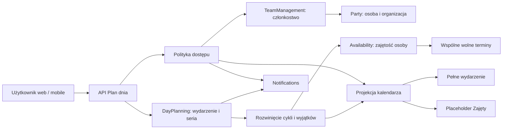

# Plan dnia: propozycja modelu i działania

Status: koncepcja zaakceptowana 21 września 2026; na jej podstawie powstała implementacja backendu, webu i mobile. Bieżący kontrakt opisuje `DAY_PLANNING_API.md`. Wdrożenie produkcyjne jest osobnym krokiem.

Analizę wykonano na wydanej wersji aplikacji. Implementacja bazuje na `origin/main` po wydaniu PR #94.

Interaktywne mockupy są dołączone do propozycji w rozmowie. Pokazują przykładowy dzień, porównanie osób, szukanie terminu i edytor, a na telefonie przechodzą do agendy. Korzystają z fikcyjnych danych; zapis pokazuje podgląd, bez tworzenia wydarzeń w aplikacji. Widok tygodnia, wiele tagów naraz i pełne pola harmonogramu opisane poniżej pozostają częścią proponowanej implementacji, poza zakresem tej makiety.

## Zakres i decyzje

Każdy użytkownik prowadzi własny kalendarz. Wydarzenia mogą udostępniać szczegóły całemu zespołowi albo tylko autorowi i zaproszonym osobom. Pozostali członkowie zespołu widzą zajętość bez treści wydarzenia. Widok planowania pomaga znaleźć wspólny termin.

Ustalenia użytkownika:

- Wydarzenia prywatne i zespołowe, uczestnicy wybierani w ramach zespołu.
- Szczegóły prywatnego wydarzenia widzą autor oraz zaproszeni uczestnicy. Pozostali widzą „Zajęty”.
- Tagi, w tym „Plan lekcji”, „Praca” i „Inne”, oraz filtrowanie według tagów.
- Cykliczne wydarzenia i wyjątki dla pojedynczych dni są częścią pierwszej wersji.
- Najpierw model i mockupy, następnie implementacja po akceptacji propozycji.

Rekomendacje przyjęte w tej koncepcji:

- Autor edytuje i usuwa wydarzenie. Administrator zespołu nie otrzymuje dodatkowych praw do cudzego kalendarza.
- Oznaczenie osoby jako uczestnika automatycznie dopisuje wydarzenie do jej planu i zajmuje jej czas. Może ona zrezygnować z udziału; zachowuje odczyt do usunięcia zaproszenia przez autora.
- Zajętość jest globalna dla osoby: uwzględnia także prywatne wydarzenia oraz wydarzenia innych zespołów. Odbiorca widzi je wyłącznie jako „Zajęty”, jeżeli nie ma prawa do szczegółów.
- Kolizja wywołuje ostrzeżenie. Można świadomie zapisać nakładające się wydarzenia.
- Pierwsza wersja obsługuje cykle dzienne i tygodniowe, w tym wybrane dni tygodnia, oraz edycję jednego wystąpienia albo całej serii.
- Pełne RSVP, „to i kolejne”, synchronizacja Google Calendar i eksport kalendarza pozostają poza pierwszą wersją.

## Granice modelu

Nowy kontekst `DayPlanning` zarządza treścią wydarzeń, uczestnictwem, cyklami i widocznością. Model `Availability` odpowiada za zajęte przedziały osoby i wspólne wolne terminy. W pierwszej wersji oba działają w istniejącym monolicie, za osobnymi kontraktami.

Oficjalny Timed Availability opisuje zasób, przedział czasu i właściciela blokady. Tutaj zasobem jest osoba, a źródłem blokady konkretne wystąpienie wydarzenia. Identyfikator źródła pozwala zwolnić tylko zajętość wywołaną danym wystąpieniem. Źródłowy model obsługuje rezerwacje wyłączne; kalendarz rodzinny dopuszcza kolizje, dlatego przechowujemy również nakładające się blokady i obliczamy ich sumę. [Timed Availability](https://www.softwarearchetypes.com/archetypes/availability/timed/)

Istniejące konteksty zachowują swoje role:

| Kontekst | Wykorzystanie |
| --- | --- |
| `Party` | Tożsamość osoby i zespołu. `PartyAdapter` zachowuje UUID użytkownika/osoby oraz zespołu/organizacji. |
| `TeamManagement` | Aktualne członkostwo i lista osób do zaproszenia przez `TeamMembershipRepositoryInterface`. |
| `UserManagement` | Uwierzytelnienie autora żądania. Właściciel wydarzenia pochodzi z sesji, nie z payloadu. |
| `ActionPlanning` | Obecne plany kroków i timer. Powiązanie kalendarza z wykonaniem planu można dodać osobno. |
| `TaskManagement` | Realizacja, zatwierdzanie i punkty za zadania. Wydarzenie nie tworzy ani nie zalicza zadania. |
| `Notifications` | Powiadomienia o zmianach z kontrolą dostępu w chwili dostarczenia. |

`ActionPlanAccess` pozwala dziś administratorowi zarządzać zespołowym planem kroków. Tej reguły nie przenosimy do kalendarza. Oficjalny katalog nie podaje osobnej specyfikacji „Planning”; w tej propozycji oznacza ono warstwę planowania korzystającą z Availability.

## Agregaty i wartości

| Element | Dane i odpowiedzialność |
| --- | --- |
| `CalendarEvent` | Agregat: ID, autor, opcjonalny zespół, tytuł, opis, miejsce, termin, widoczność, uczestnicy, tagi, zajmowanie czasu, cykl, status i wersja. |
| `Participation` | Osoba, data zaproszenia, udział `INCLUDED` albo `DECLINED`, opcjonalne odpowiedzi dla pojedynczych wystąpień. Prawo odczytu wynika z istniejącego zaproszenia. |
| `EventSchedule` | Termin godzinowy ze strefą albo zakres dat dla wydarzenia całodniowego. |
| `RecurrenceRule` | Podzbiór RRULE: `DAILY`, `WEEKLY`, `INTERVAL`, `BYDAY` i opcjonalne zakończenie. |
| `OccurrenceException` | Klucz oryginalnego wystąpienia oraz anulowanie albo nadpisane pola jednego wystąpienia. |
| `CalendarTag` | Agregat: nazwa, kolor, zakres `PERSONAL` lub `TEAM`, właściciel zakresu i archiwizacja. |
| `EventOccurrence` | Wyliczone konkretne wystąpienie po zastosowaniu reguły i wyjątku. Nie jest niezależną kopią całej serii. |
| `BusyInterval` | Osoba, rzeczywisty przedział czasu, wewnętrzny klucz źródła. Bez tytułu, miejsca, tagów i listy uczestników. |
| `PlanningQuery` | Uczestnicy, zakres dat, długość spotkania, godziny poszukiwań i strefa wyświetlania. |

Referencje między kontekstami używają UUID i kontraktów aplikacyjnych. Uczestnik wydarzenia nie wymaga nowego trwałego `PartyRole`; jego rolę w wydarzeniu opisuje `Participation`.

`CalendarEvent` przechowuje autora osobno od uczestników. Przy tworzeniu serwer zawsze dodaje autora z udziałem `INCLUDED`; po utworzeniu może on zrezygnować z własnego udziału bez utraty praw zarządzania. Samo udostępnienie zespołowi nie zajmuje czasu wszystkim członkom.

Wydarzenie osobiste bez innych uczestników może mieć `teamId = null`. Zaproszenie innej osoby lub widoczność `TEAM` wymaga wskazania jednego zespołu. Wszystkie nowe zaproszenia dotyczą jego aktualnych członków.

## Prawa dostępu

| Odbiorca | Prywatne szczegóły | Zespołowe szczegóły | Edycja wydarzenia | Własny udział |
| --- | --- | --- | --- | --- |
| Autor | Tak | Tak | Tak | Tak |
| Zaproszony, bierze udział | Tak | Tak | Nie | Tak |
| Zaproszony, zrezygnował | Tak, do usunięcia zaproszenia | Tak | Nie | Tak |
| Aktualny członek zespołu bez zaproszenia | Tylko „Zajęty” | Tak | Nie | Nie |
| Administrator bez zaproszenia | Tylko „Zajęty” | Tak | Nie | Nie |
| Osoba spoza uprawnionego zespołu | Brak | Brak | Nie | Nie |

Wyjątek od ostatniego wiersza stanowi autor własnego wydarzenia. Wygaszenie członkostwa ma opisane niżej skutki dla istniejących zaproszeń. Globalna rola administracyjna nie stanowi obejścia prywatności.

Zmiana `TEAM` na `PRIVATE` odbiera szczegóły pozostałym członkom zespołu, ale zachowuje odczyt zaproszonych. Zmiana na `TEAM` pokazuje w edytorze konkretny zespół jako nowych odbiorców. Prawo zmiany widoczności ma autor.

Usunięcie zaproszenia odbiera dostęp do prywatnych szczegółów i usuwa przyszłą zajętość tej osoby. Rezygnacja zachowuje zaproszenie: osoba nadal widzi zmiany, ale jej czas pozostaje wolny. Edycja wydarzenia przez autora nie zeruje rezygnacji.

## Prywatność jako kontrakt API

Odpowiedź kalendarza zawiera rozłączne typy danych. `EventDetails` obejmuje dozwolone szczegóły i możliwości odbiorcy, np. `canEdit` i `canChangeParticipation`. `BusyPlaceholder` ma jedynie `kind`, `personId`, `start`, `end` oraz etykietę „Zajęty”.

Placeholder nie zawiera identyfikatora wydarzenia/serii, tytułu, autora, tagów, miejsca, opisu ani innych uczestników. Nakładające się ukryte blokady można scalać, aby nie ujawniać liczby wydarzeń. Ewentualny klucz renderowania jest lokalny dla odpowiedzi i nie służy do otwarcia szczegółów.

Serwer od razu buduje właściwe DTO. Pełna treść nie trafia do przeglądarki lub telefonu z poleceniem jej ukrycia. Kontrola obejmuje listę, szczegóły, wyszukiwanie, sugestie, konflikty, powiadomienia i eksporty dodane w przyszłości. Politykę stosujemy po nałożeniu wyjątków, osobno do każdego wystąpienia; dostęp do jednej daty nie daje odczytu innych dat ani surowej listy wyjątków.

Bez prawa do szczegółów `GET` po ID zwraca 404, niezależnie od istnienia wydarzenia. Zapytanie o cudzą dostępność wymaga aktualnego wspólnego zespołu i nie działa dla dowolnej listy UUID.

Oddzielenie przedziałów wolny/zajęty od treści odpowiada regułom prywatności opisanym w [RFC 7953, sekcja 9](https://www.rfc-editor.org/rfc/rfc7953#section-9).

## Uczestnictwo i zajętość

Domyślnie nowe wydarzenie ma `blocksTime = true`. Wydarzenie informacyjne może nie zajmować czasu. Ukryte wydarzenie, które nie zajmuje czasu, nie tworzy placeholdera „Zajęty”. Anulowane wystąpienie również nie blokuje czasu.

Zajętość powstaje dla każdej osoby z udziałem `INCLUDED`. `DECLINED` nie tworzy blokady. Rezygnacja może dotyczyć jednego wystąpienia albo całej serii; odpowiedź dla wystąpienia jest nadrzędna względem odpowiedzi dla serii.

W pierwszej wersji nie ma oczekiwania na akceptację. Formularz autora informuje: „Dodanie uczestnika umieszcza wydarzenie w jego planie. Uczestnik może zrezygnować”. Informacja o nowym wydarzeniu trafia do zaproszonych.

Zmiana terminu, uczestników lub wyjątku przelicza odpowiednie zajętości. Operacja zwolnienia wskazuje źródło: anulowanie jednego wydarzenia nie zwalnia nakładającego się drugiego wydarzenia.

Rekomendacja globalnej dostępności oznacza, że w widoku zespołu A blokują także wydarzenia osoby z zespołu B. Tytuł z zespołu B nie jest udostępniany tylko dlatego, że obie osoby należą do zespołu A.

## Tagi i filtrowanie

Tagi zespołowe są wspólnym słownikiem: każdy członek może ich używać, administrator zarządza słownikiem. Tagi osobiste tworzy i zmienia ich właściciel. Archiwizacja tagu nie usuwa historycznych przypisań.

W pierwszej wersji osobisty tag można przypinać do własnego wydarzenia prywatnego. Wydarzenia zespołowe używają tagów wskazanego zespołu. Udostępnienie wydarzenia z osobistymi tagami wymaga usunięcia lub zastąpienia tych tagów; UI pokazuje to przed zapisem.

Zaproszony do prywatnego wydarzenia widzi jego tagi jako część szczegółów, lecz nie uzyskuje dostępu do całego osobistego słownika autora. Nie pokazujemy tagów osobistych w globalnych podpowiedziach innych osób.

Kilka wybranych tagów działa jako OR: wydarzenie pasuje, gdy ma dowolny z nich. Bez wybranego tagu pokazywane są wszystkie dostępne szczegóły. Filtr uczestników łączy się z filtrem tagów przez AND.

Filtr tagów nigdy nie usuwa ukrytej zajętości i nie zmienia obliczeń wspólnego terminu. Nie można sprawdzać, czy prywatna blokada zniknie po wybraniu „Praca”. Przy aktywnym filtrze widok wyjaśnia, że planowanie uwzględnia wszystkie blokujące wydarzenia.

## Czas, cykle i wyjątki

Przedziały mają postać `[start, end)`. Wydarzenie 10:00–11:00 nie koliduje z 11:00–12:00. Koniec musi następować po początku. Obsługiwane są wydarzenia przechodzące przez północ.

Konkretne wystąpienia porównujemy jako chwile UTC. Seria zachowuje lokalną godzinę rozpoczęcia, długość wydarzenia i strefę IANA, np. `Europe/Warsaw`; zmiana strefy urządzenia wpływa na prezentację, nie przenosi wydarzenia. „W poniedziałki o 08:00” pozostaje o 08:00 po zmianie czasu.

Wydarzenie całodniowe przechowuje datę początku i wyłączną datę końca. Przy obliczeniu zajętości granice dat są rozwiązywane w strefie wydarzenia. Nie przeliczamy dnia na stałe 24 godziny.

Podzbiór cykli w v1:

- Co N dni albo co N tygodni w wybrane dni tygodnia; „dni robocze” oznacza poniedziałek–piątek, bez automatycznego uwzględniania świąt.
- Koniec w wybranym dniu, po wskazanej liczbie wystąpień albo bez końca. Data końcowa w UI obejmuje ten dzień w strefie serii.
- Pominięcie jednego wystąpienia albo zmiana jego terminu i innych pól; zmiana częstotliwości dotyczy całej serii.

API przyjmuje opis strukturalny reguły i waliduje obsługiwany podzbiór; nie przepuszcza dowolnego tekstu RRULE. Miesięczne cykle oraz import obcych reguł są poza v1.

Klucz wyjątku `originalRecurrenceKey` wskazuje termin, w którym dane wystąpienie pierwotnie miało się odbyć. Po przesunięciu z wtorku na środę pozostaje wtorkowy. Dla całodniowego wpisu kluczem jest pierwotna data, dla godzinowego lokalna data i czas w strefie serii.

Wyjątek nadpisuje wyłącznie zmienione pola. Pozostałe dziedziczy z serii. Zapytanie po zakresie uwzględnia również wyjątek przeniesiony do zakresu z dnia leżącego poza nim i nie wyświetla starego terminu drugi raz.

Zmiana treści całej serii zachowuje nadpisania pojedynczych wystąpień. Dla zmiany samej reguły lub bazowego terminu z istniejącymi wyjątkami proponujemy w v1 jawne ponowne ustalenie harmonogramu: UI pokazuje wyjątki do usunięcia i wymaga zatwierdzenia ich resetu. Bez tego serwer zwraca konflikt i nie zapisuje zmiany. Nie wolno po cichu zgubić wyjątków.

Edycja „to i kolejne” wymaga rozdzielenia serii i jest odłożona. Po akceptacji koncepcji należy potwierdzić, czy opisane ograniczenie resetu wyjątków jest wystarczające dla pierwszej wersji.

Nieistniejącą jednorazową godzinę podczas zmiany czasu odrzucamy z komunikatem. W cyklu pomijamy nieistniejące wystąpienie i pokazujemy to w podglądzie; przy dwuznacznej godzinie przyjmujemy pierwsze wystąpienie. Wybór drugiego można zapisać jako jednoznaczny wyjątek. Granice czasu, identyfikatory wyjątków i reguły powtarzania opieramy na [RFC 5545](https://www.rfc-editor.org/rfc/rfc5545).

## Znajdowanie terminu i konflikty

Użytkownik wybiera zespół i uczestników, długość spotkania, zakres dni oraz godziny poszukiwań. Planer nowego wydarzenia obowiązkowo uwzględnia autora: jego wybór jest stały w UI, a API dodaje go do zapytania niezależnie od payloadu. W zwykłym widoku zespołu można odfiltrować własny kalendarz. Domyślna długość to 60 minut, domyślne okno wyszukiwania obejmuje najbliższy tydzień. W UI zawsze widać strefę czasu.

Silnik rozwija cykle z wyjątkami, zbiera zajętość wszystkich wskazanych osób, scala przedziały i odejmuje ich sumę od okna poszukiwań. Zwraca wolne przedziały, w których mieści się wymagany czas. Brak wpisu oznacza brak znanej zajętości, nie obietnicę obecności osoby.

Wybór propozycji otwiera edytor z terminem i uczestnikami. Sama propozycja nie blokuje czasu. Zapis ponownie sprawdza kolizje, a użytkownik może zaakceptować je przyciskiem „Zapisz mimo kolizji”.

Odpowiedź konfliktu podaje osobę i nakładający się przedział. Tytuł pojawia się tylko przy prawie do szczegółów. Nieuprawniony odbiorca dostaje „Zajęty”; nie poznaje autora ani tagów kolidującego wydarzenia.

Zmiana wydarzenia korzysta z wersji agregatu i `If-Match`. Nieaktualna wersja daje 412 i wymaga odświeżenia. Ostrzeżenie o kolizji to osobny 409 z krótkotrwałym tokenem potwierdzenia, powiązanym z użytkownikiem, payloadem i stanem zajętości. Nowa kolizja wymaga nowego potwierdzenia.

To model miękkich konfliktów: nie obiecujemy trwałej wyłączności terminu. Równoczesne zapisy muszą pozostawić spójne wydarzenia, a aktualny odczyt musi pokazać powstałą kolizję. Nie stosujemy globalnego `EXCLUDE`, który uniemożliwiłby świadomy overlap.

## Widoki webowe i mobilne

| Ekran | Zachowanie |
| --- | --- |
| Mój plan | Dzień i tydzień, nawigacja po datach, tagi, własne wydarzenia i zaproszenia. Wpis pokazuje czas, tytuł i stan prywatności. |
| Plan zespołu | Wybrane osoby, wspólna oś czasu, udostępnione wydarzenia i neutralne bloki „Zajęty”. Dostęp do szczegółów wynika z uprawnień. |
| Znajdź termin | Osoby, długość, dni i godziny; porównanie zajętości oraz propozycje wspólnego czasu. |
| Edytor | Treść, termin, strefa, całodniowość, cykl, uczestnicy, widoczność, tagi i zajmowanie czasu. Przy edycji serii wybór zakresu zmiany. |
| Mobile: agenda | Lista dnia, pasek wyboru daty, filtry i przycisk dodania. Planowanie otwiera czytelną listę propozycji, z opcją porównania osób. |

Prywatność jest opisana tekstem: „Autor i zaproszone osoby” albo „Cały zespół: [nazwa]”. Przełączenie widoczności aktualizuje informację o odbiorcach przed zapisem. Kolor tagu nie jest jedynym sposobem odróżnienia wydarzeń.

Placeholder ma neutralny kolor i etykietę „Zajęty”. Nie prowadzi do szczegółów wydarzenia; może jedynie pokazać neutralną informację o przedziale i prywatności. Formularze i wybór terminu muszą działać klawiaturą; mobile nie wymaga przeciągania.

## Szkic API

Wszystkie operacje wymagają uwierzytelnienia. Zakres osoby i zespołu jest autoryzowany na serwerze. Nazwy endpointów są propozycją, do uzgodnienia z obecną konwencją API podczas implementacji.

| Metoda | Ścieżka | Zastosowanie |
| --- | --- | --- |
| GET | `/api/day-planning/calendar` | `from`, `to`, `teamId`, `personIds[]`, `tagIds[]`; dozwolone szczegóły oraz placeholdery. |
| GET | `/api/day-planning/events/{id}` | Definicja wydarzenia/serii do zarządzania, dostępna autorowi. |
| GET | `/api/day-planning/events/{id}/occurrences/{occurrenceKey}` | Szczegóły konkretnego wystąpienia po ocenie jego uczestników i widoczności; klucz `single` dla jednorazowego wpisu. |
| POST | `/api/day-planning/events` | Utworzenie wydarzenia; autor z sesji, `Idempotency-Key` zabezpiecza ponowienie z mobile. |
| PATCH | `/api/day-planning/events/{id}` | Zmiana całego wydarzenia/serii z `If-Match`. |
| DELETE | `/api/day-planning/events/{id}` | Anulowanie wydarzenia/serii i usunięcie przyszłej zajętości. |
| PUT | `/api/day-planning/events/{id}/exceptions/{occurrenceKey}` | Nadpisanie lub anulowanie jednego wystąpienia. |
| DELETE | `/api/day-planning/events/{id}/exceptions/{occurrenceKey}` | Usunięcie wyjątku i przywrócenie terminu wynikającego z serii. |
| PUT | `/api/day-planning/events/{id}/participation/me` | `INCLUDED`/`DECLINED`, zakres serii albo wskazanego wystąpienia. |
| POST | `/api/day-planning/availability/query` | Przedziały wolny/zajęty dla dozwolonych osób i zakresu. |
| POST | `/api/day-planning/planning/suggestions` | Wspólne terminy o wymaganej długości. |
| GET / POST | `/api/day-planning/tags` | Dostępny słownik i tworzenie tagów w uprawnionym zakresie. |
| PATCH / DELETE | `/api/day-planning/tags/{id}` | Zmiana lub archiwizacja tagu przez właściciela zakresu. |

Payload wydarzenia obejmuje `title`, `description`, `location`, `teamId`, `visibility`, `schedule`, `recurrence`, `participantIds`, `tagIds` i `blocksTime`. Nie przyjmuje `ownerId` ani uprawnień odbiorcy. Tworzenie z `PRIVATE` i bez `teamId` dopuszcza wyłącznie autora jako uczestnika. PATCH harmonogramu z wyjątkami wymaga jawnego `resetExceptions` po pokazaniu skutków; zwykły zapis domyślnie ich nie usuwa.

`schedule` jest rozłącznym typem `TIMED` albo `ALL_DAY`. W wariancie godzinowym przenosi lokalny początek, długość i strefę; dla jednoznacznego wyjątku DST także wybrane przesunięcie. Wariant całodniowy przenosi daty graniczne i strefę, bez godzin.

Odpowiedź kalendarza ma `events`, `busy` i `coverage`. `events` przechodzi filtr tagów; `busy` zawiera ukrytą zajętość niezależnie od tagów. Availability i sugestie nie przyjmują tagów. Zakres żądania jest ograniczony do 90 dni; dłuższy zakres wymaga podziału.

`coverage` potwierdza pełne rozwinięcie źródeł dla wszystkich wskazanych osób w żądanym przedziale. Przekroczenie limitu złożoności zwraca czytelny błąd zawężenia zakresu. Nie zwracamy częściowego wyniku jako „wolny”.

## Spójność, członkostwo i dostarczanie zmian

Definicja serii i wyjątki są źródłem prawdy. Odczyt rozwija je w ograniczonym oknie. Materializacja wystąpień jest optymalizacją: przed użyciem musi mieć aktualną wersję i pełne pokrycie okna albo odczyt wraca do źródła.

Zapis wydarzenia oraz danych potrzebnych do odtworzenia zajętości jest atomowy. Przy projekcji asynchronicznej nieaktualny zakres nie jest uznawany za wolny. W pierwszej wersji zalecany jest synchroniczny odczyt z poprawnego źródła i cache z wersjonowaniem.

Zdarzenia aplikacyjne obejmują utworzenie i zmianę wydarzenia, anulowanie wystąpienia, zmianę uczestnictwa oraz zmianę widoczności. Powiadomienia można dostarczać przez istniejący mechanizm po transakcji; ponowienie nie może dublować komunikatów.

Powiadomienie nie rozsyła tytułu prywatnego wydarzenia całemu zespołowi. Domyślny push jest neutralny, np. „Masz nowe wydarzenie”; aplikacja pobiera treść po uwierzytelnieniu. Przed dostarczeniem opóźnionej wiadomości serwer ponownie sprawdza uprawnienia i aktualny stan wydarzenia.

Rezygnujący uczestnik może dostać wiadomość o zmianie wydarzenia, bo nadal jest zaproszony. Po usunięciu zaproszenia komunikat o odwołaniu nie zawiera dawnych szczegółów. Pełne przypomnienia i ich harmonogram można wydzielić jako kolejny etap.

Cache szczegółów zależy od odbiorcy i wersji uprawnień. Zmiana widoczności, usunięcie uczestnika lub zmiana członkostwa unieważnia cache. Backend sprawdza prawa przy każdym odczycie, niezależnie od ważności projekcji.

Web i mobile usuwają nieaktualne szczegóły po zdarzeniu synchronizacji i odświeżają kalendarz po powrocie na ekran. Przy wylogowaniu czyszczą dane użytkownika. Serwer nie cofnie informacji już przeczytanej przez odbiorcę; nie projektujemy nieograniczonego cache offline prywatnych kalendarzy.

Rekomendacja dotycząca odejścia z zespołu: były członek natychmiast traci dostęp wynikający z członkostwa oraz dostęp do zajętości pozostałych. Jego zaproszenia z tego zespołu wygasają i nie blokują przyszłego czasu. Rezygnacja z udziału i odejście z zespołu są odrębnymi przypadkami.

Odejście autora wygasza zespołowe udostępnienie jego wydarzeń i przyszłe zaproszenia związane z tym zespołem; własne wydarzenia zachowuje. Historia pozostaje dla autora, a serwer nie rozszerza jej odbiorców po ponownym dołączeniu. Regułę należy zaimplementować jawnie razem z obsługą usunięcia zespołu.

## Etapy realizacji po akceptacji

1. Utrwalić decyzje o globalnej zajętości, odejściu z zespołu i zmianach serii z wyjątkami. Zamknąć kontrakty DTO oraz makiety web/mobile.
2. Wprowadzić domenę wydarzeń, uczestnictwo, tagi i politykę prywatności. Dodać API oraz migracje na aktualnej wersji projektu.
3. Zaimplementować cykle, wyjątki i Availability ze wspólnymi terminami. Zakończyć testy prywatności i czasu przed udostępnieniem funkcji.
4. Dostarczyć widoki webowe i mobilne na wspólnym kontrakcie. Dodać powiadomienia o zaproszeniach i zmianach oraz obsługę unieważniania cache.
5. Przeprowadzić odbiór na środowisku testowym, sprawdzić aktualizację aplikacji i przygotować wydanie w zwykłym procesie projektu.

Etapy opisują kolejność pracy. Pierwsze wydanie funkcji obejmuje również cykle i pojedyncze wyjątki.

## Kryteria odbioru

| Scenariusz | Oczekiwany wynik |
| --- | --- |
| Autor tworzy prywatny wpis | Autor widzi szczegóły; członek i administrator zespołu widzą tylko osobę i przedział „Zajęty”. |
| Prywatny wpis ma `blocksTime = false` | Uprawnieni widzą wydarzenie; inni nie widzą ani szczegółów, ani placeholdera „Zajęty”. |
| Autor zaprasza osobę | Osoba od razu widzi prywatne szczegóły i ma zajęty czas. Pozostali nie poznają listy zaproszonych. |
| Zaproszony rezygnuje | Nie ma blokady jego czasu, nadal odczytuje szczegóły; edycja autora nie przywraca udziału. |
| Autor usuwa zaproszenie | Znika odczyt prywatnych szczegółów oraz przyszła blokada; bezpośrednie żądanie po ID zwraca 404. |
| Administrator próbuje edytować cudzy wpis | Żądanie jest odrzucone, niezależnie od możliwości wysłania go poza UI. |
| Widoczność zmienia się na prywatną | Osoby bez zaproszenia tracą szczegóły w API, cache i późniejszych powiadomieniach. |
| Użytkownik ma wydarzenie w drugim zespole | Wspólny termin w pierwszym zespole uwzględnia blokadę bez ujawnienia jej źródła. |
| Autor ma kolizję, a pozostali są wolni | Planer nie proponuje tego terminu jako wspólnie wolnego; pominięcie autora w payloadzie nie obchodzi reguły. |
| Wybrano kilka tagów | Widoczne szczegóły pasują do dowolnego tagu; ukryte blokady i wyniki planowania nie zmieniają się. |
| Próba filtrowania prywatnego tagu | Placeholder nie ujawnia przypisania; podpowiedzi nie zwracają osobistego słownika autora. |
| Spotkania stykają się o 11:00 | Nie są oznaczone jako kolizja. Nakładające się przedziały wywołują ostrzeżenie. |
| Użytkownik potwierdza kolizję | Zapis działa; bieżący odczyt pokazuje oba wydarzenia i zajętość będącą ich sumą. |
| Usunięto jeden z nakładających się wpisów | Drugi nadal blokuje swój przedział. |
| Cotygodniowy wpis przechodzi zmianę czasu | Lokalna godzina rozpoczęcia pozostaje stała; rzeczywisty przedział UTC jest poprawny. |
| Całodniowy wpis obejmuje zmianę czasu | Obejmuje wybrane daty lokalne, także przy dniu trwającym 23 lub 25 godzin. |
| Wystąpienie przeniesiono poza pierwotny tydzień | Pojawia się raz w nowym zakresie, znika ze starego, zachowuje oryginalny klucz wyjątku. |
| Wyjątek zmienia uczestników lub widoczność jednej daty | Odczyt tej daty respektuje nadpisanie, bez przyznania dostępu do pozostałych wystąpień. |
| Anulowano pojedynczy dzień serii | Pozostałe wystąpienia i ich uczestnictwo pozostają bez zmian. |
| Zmiana harmonogramu wymaga resetu wyjątków | Serwer nic nie usuwa bez jawnego zatwierdzenia listy zmian. |
| Seria nie ma końca | Odczyt ogranicza rozwinięcie do zakresu; brak projekcji nie daje fałszywie wolnego terminu. |
| Dwa urządzenia edytują tę samą wersję | Drugi zapis dostaje 412; dane pierwszego urządzenia nie zostają nadpisane. |
| Mobile ponawia utworzenie po utracie sieci | Ten sam klucz idempotencji daje jedno wydarzenie. |
| Uczestnik opuszcza zespół | Traci uprawnienia i przyszły udział według opisanej polityki; cache i wiadomości respektują zmianę. |
| Użytkownik zmienia urządzenie | Ten sam zakres i strefa dają zgodny kalendarz i wyniki planowania w webie i mobile. |

## Źródła

- [Software Archetypes: Timed Availability](https://www.softwarearchetypes.com/archetypes/availability/timed/) i [oficjalny kod modelu](https://github.com/Software-Archetypes/archetypes/tree/main/availability/timed-availability): zasoby, blokady i stabilny kontrakt dostępności.
- [Software Archetypes: wprowadzenie](https://www.softwarearchetypes.com/archetypes/introduction/): rola Availability oraz Party.
- [RFC 5545](https://www.rfc-editor.org/rfc/rfc5545): przedziały, strefy, RRULE, EXDATE i RECURRENCE-ID; używamy jawnie ograniczonego podzbioru.
- [RFC 7953](https://www.rfc-editor.org/rfc/rfc7953): obliczanie dostępności i ograniczanie informacji w odpowiedziach wolny/zajęty.
- Kod wydania: `src/Party/Application/Service/PartyAdapter.php`, `src/TeamManagement/Domain/Repository/TeamMembershipRepositoryInterface.php`, `src/TeamManagement/Infrastructure/Persistence/PartyTeamMemberships.php`, `src/ActionPlanning/Domain/Entity/ActionPlan.php`, `src/ActionPlanning/Application/Service/ActionPlanAccess.php` oraz `docs/ACTION_PLANS.md`.
